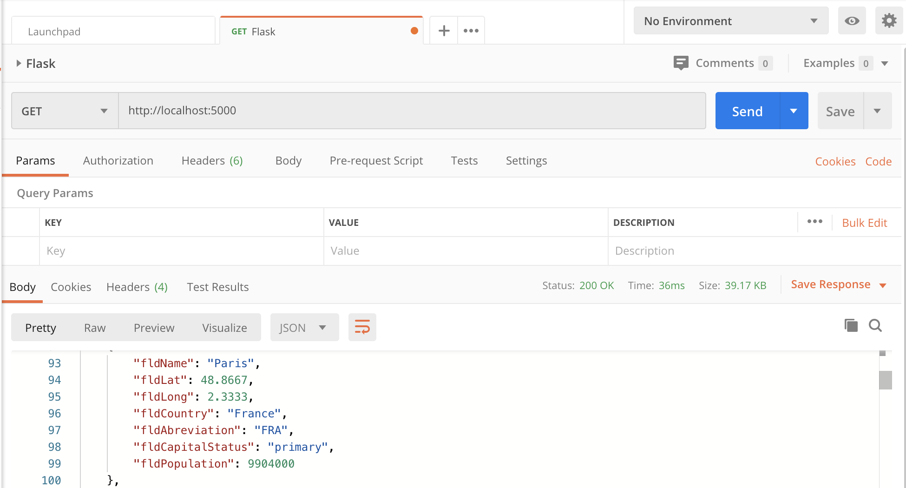

#Project Description
This project is an homework assignment on how to get Pycharm setup with Docker,Flask,MYSQL
#Postman ScreenShot



## Getting Started

**Step 1:** Make sure git is installed on your os. I will be using macOS for the project.

On macOS, you can install the git using Homebrew using ```brew install git```

**Step 2:** Clone the project into your local machine using below command.

```git clone https://github.com/KartikShrikantHegde/Docker-Flask-MySQL.git```

### Prerequisites

**1. Docker**

Make sure you have Docker installed. Please follow the below link for official documentation from Docker to install latest version of docker on your os. For this project I am using Docker CE (18.09).

```https://docs.docker.com/docker-for-mac/install/```

### Installing

**Step 1:** Change to the directory where the project was cloned in previous step.

```
cd Docker-Flask-MySQL
```

**Step 2:** Make sure Docker is up and running. You can start the docker engine from desktop icon on Mac.

**Step 3:** Run

```
docker-compose up --build
```

**Step 4:** Open up the browser and paste the below url

```
http://localhost:8000/
```

The browser should display ```Hello World ! I am back with db running .!``` message. The app is up and running inside a docker container using docker-compose.

**Step 5:** Verify DB is up and running and tables are created

Use any of the database clients like MySQL workbench or SQLDeveloper. In my case, I am using the Pycharm DB plugin. Make sure you have the driver installed for the MySQL db running on the client you are using.

Connect to MySQL database using the properties specified in ```docker-compose.yml``` file with host as ```localhost```.

**Note:** 

1. Don't use the ```MYSQL_ROOT_PASSWORD``` but the password for the db you created, i.e ```MYSQL_PASSWORD```

2. The port to be used is ```32000``` which is the port on which app is running on localhost. Don't use ```3306``` as port to connect from the client as it's the port where container is running.

Once connected, run simple commands like ```show tables``` or ```desc <<tablename>>``` to make sure table is created with exact fields specified in the Flask models.

## Running the tests

## Deployment

## Built With

* [Docker](http://www.dropwizard.io/1.0.2/docs/) -  Deployment model
* [Flask](https://maven.apache.org/) - The web framework
* [Python](https://rometools.github.io/rome/) - programming language
* [pip](https://rometools.github.io/rome/) - Package and dependency manager
* [MySQL](https://rometools.github.io/rome/) - Database

## Contributing

## Versioning

## Authors

## License

## Acknowledgments
